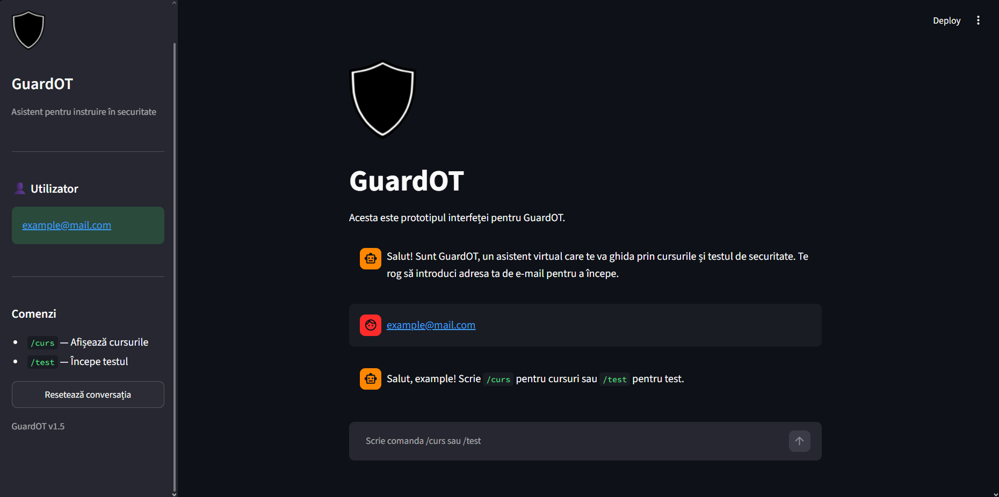
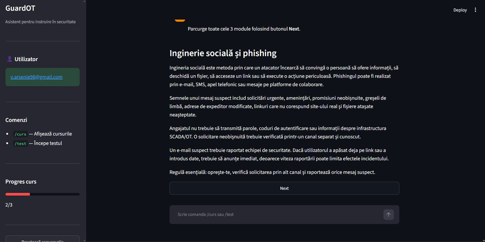
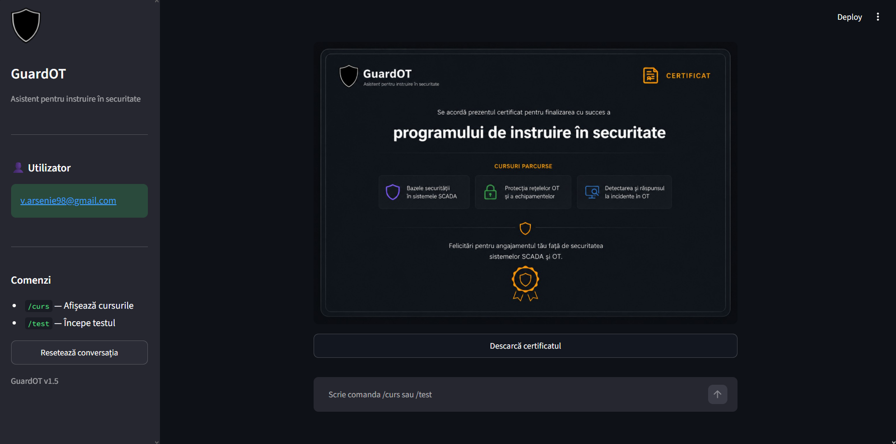
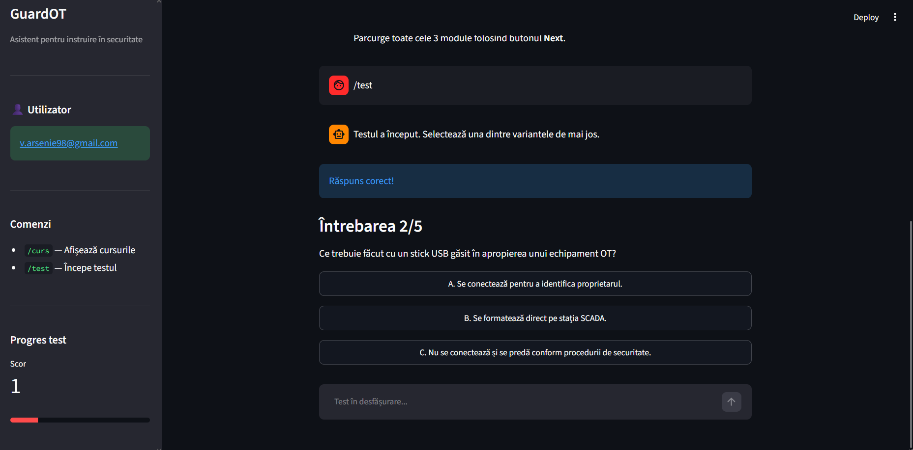
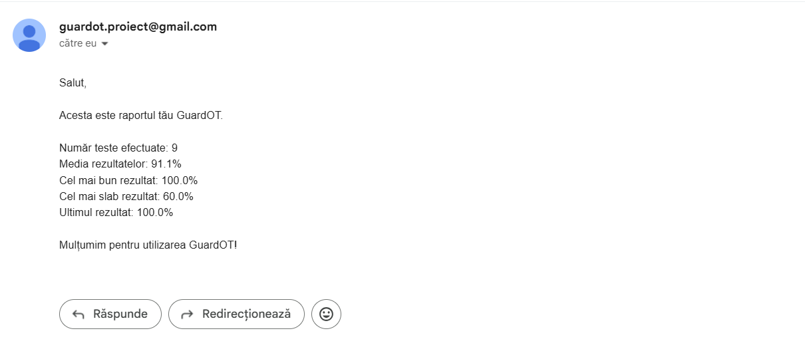

<p align="center">
  
</p>

<h1 align="center">GuardOT</h1>

<p align="center">
Asistent virtual pentru instruirea și evaluarea utilizatorilor în domeniul securității cibernetice pentru mediile OT (Operational Technology).
</p>

<p align="center">


</p>

---

# 📖 Descriere

GuardOT este o aplicație dezvoltată în **Python** folosind **Streamlit**, care are rolul de a instrui și evalua utilizatorii în domeniul securității cibernetice.

Aplicația oferă un flux complet de instruire:

- autentificare pe baza adresei de e-mail;
- recomandări zilnice privind securitatea;
- cursuri interactive;
- teste de evaluare;
- salvarea rezultatelor;
- dashboard de analiză pentru administrator;
- transmiterea rezultatelor prin e-mail.

---

# 📷 Interfața aplicației

## Chat

<p align="center">

</p>

Chatbot-ul GuardOT ghidează utilizatorul pe tot parcursul aplicației și permite utilizarea comenzilor disponibile.

---

## Cursuri interactive

Utilizatorul parcurge modulele de instruire unul câte unul, beneficiind de o bară de progres și de navigare intuitivă.

<p align="center">
  
</p>

La finalizarea tuturor cursurilor, aplicația generează un certificat de absolvire care poate fi descărcat în format PNG.

<p align="center">
  
</p>

---

## Test de evaluare

<p align="center">

</p>

Testul conține întrebări cu variante multiple.

La finalul testului:

- răspunsurile sunt evaluate automat;
- este calculat scorul final;
- rezultatul este salvat în fișierul CSV.

---

## Dashboard Administrator

<p align="center">

</p>

Dashboard-ul este disponibil exclusiv administratorului și conține:

- numărul total de teste efectuate;
- numărul de teste promovate;
- rata de promovare;
- grafic al rezultatelor;
- tabel cu toate rezultatele utilizatorilor.

---

# ✨ Funcționalități

## 🔐 Autentificare

- autentificare folosind adresa de e-mail;
- validarea formatului e-mailului;
- identificarea administratorului;
- afișarea dashboard-ului doar administratorului.

---

## 💡 Sfatul zilei

La pornirea aplicației este afișat automat un sfat privind securitatea cibernetică.

Sfatul se schimbă automat în fiecare zi.

---

## 📚 Cursuri

Comanda

```text
/curs
```

permite utilizatorului să parcurgă modulele de instruire.

La final este oferit un certificat care poate fi descărcat.

---

## 📝 Test

Comanda

```text
/test
```

pornește evaluarea.

Aplicația:

- verifică răspunsurile;
- calculează scorul;
- salvează rezultatul.

---

## 📊 Dashboard

Dashboard-ul afișează:

- statistici generale;
- promovabilitatea;
- rezultatele individuale;
- procentul obținut;
- istoricul testelor.

---

## 📧 Trimiterea rezultatelor prin e-mail

Administratorul poate transmite rezultatele utilizatorilor folosind un buton dedicat din dashboard.

<p align="center">

</p>

---

# 📁 Structura proiectului

```text
GuardOT/
│
├── app.py
├── config.py
├── README.md
│
├── assets/
│   ├── scut.png
│   └── certificat_guardot.png
│
├── screenshots/
│   ├── chat.png
│   ├── curs.png
│   ├── certificat.png
│   ├── test.png
│   ├── email.png
│   └── dashboard .png
│
├── data/
│   ├── cursuri.json
│   ├── quiz.json
│   └── raport.csv
│
└── src/
    ├── __init__.py
    ├── autentificare.py
    ├── comenzi.py
    ├── dashboard_admin.py
    ├── email_service.py
    ├── evaluare_raspunsuri.py
    ├── interactivitate_curs.py
    ├── interactivitate_test.py
    ├── persistenta_rezultate.py
    └── sfatul_zilei.py
```

---

# 🛠️ Tehnologii utilizate

- Python 3
- Streamlit
- Pandas
- JSON
- CSV
- SMTP (Gmail)

---

# 🚀 Instalare

## 1. Clonează repository-ul

```bash
git clone https://github.com/Arsenie-Vlad/ChatBot.git
```

```bash
cd ChatBot
```

---

## 2. Creează un mediu virtual

Windows

```bash
python -m venv env
```

Activare

```bash
env\Scripts\activate
```

Linux / macOS

```bash
python3 -m venv env
```

```bash
source env/bin/activate
```

---

## 3. Creează fișierul `config`

În directorul principal creează fișierul:

```text
config.py
```

cu următorul conținut:

```text
ADMIN_EMAIL=admin@email.com

EMAIL_ADDRESS=adresa_ta@gmail.com

EMAIL_PASSWORD=parola_aplicatie_gmail
```

---

## 4. Rulează aplicația

```bash
streamlit run app.py
```

Aplicația va fi disponibilă la:

```
http://localhost:8501
```

---

# 📄 Fișiere generate

În timpul utilizării aplicației este creat automat:

```text
data/raport.csv
```

Acesta conține:

- numele utilizatorului;
- adresa de e-mail;
- scorul obținut;
- data efectuării testului.

---

# 👤 Administrator

Dashboard-ul este disponibil doar pentru adresa configurată în:

```text
ADMIN_EMAIL
```

---

Acest proiect a fost realizat în scop educațional, în cadrul practicii de specialitate.
